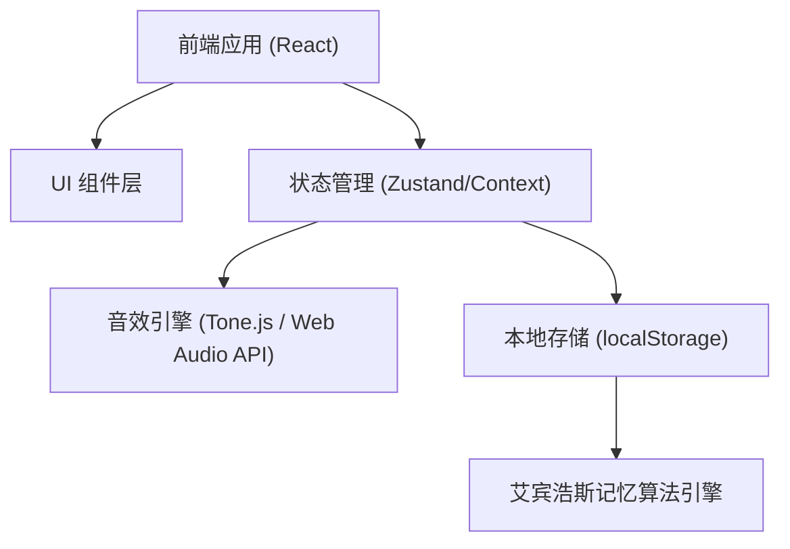

## 1. 架构设计


## 2. 技术说明
- 前端框架：React@18 + tailwindcss@3 + vite
- 状态管理：Zustand (适合处理复杂的进度和音频状态)
- 音频处理：Tone.js (生成钢琴音效，无需外部音频文件，支持复音和音符解析)
- 图标：Lucide React
- 动画：Framer Motion (用于按键按下反馈和音符切换动画)

## 3. 路由定义
| 路由 | 目的 |
|-------|---------|
| / | 首页（关卡地图与进度展示） |
| /level/:id | 具体的游戏/学习关卡页面 |

## 4. API 定义 (仅前端)
本应用采用纯前端架构，无需与后端服务器交互。

## 5. 数据模型
### 5.1 核心数据结构定义
```typescript
// 用户进度
interface UserProgress {
  currentLevel: number;
  unlockedLevels: number[];
  failedNotes: FailedNoteRecord[];
}

// 错误记录（用于艾宾浩斯记忆）
interface FailedNoteRecord {
  note: string; // 音符，如 "C4"
  failCount: number; // 失败次数
  lastFailedAt: number; // 时间戳
  nextReviewAt: number; // 根据遗忘曲线计算的下次复习时间
  reviewStage: number; // 处于遗忘曲线的哪个阶段 (0: 5min, 1: 30min, 2: 12hr, 3: 1day 等)
}

// 关卡定义
interface Level {
  id: number;
  title: string;
  description: string;
  type: 'teaching' | 'single_note' | 'multi_note' | 'song' | 'review';
  targetNotes: string[] | string[][]; // 单音数组，或和弦/曲目数组
  requiredScore: number;
}
```

### 5.2 遗忘曲线逻辑定义
- 当用户在测试关卡（非教学关卡）中弹奏错误时，该音符将被记录到 `failedNotes`。
- 如果用户之前错误过该音符，则重置 `reviewStage = 0` 并更新 `lastFailedAt`。
- `reviewStage` 的时间间隔数组大致为：`[5 * 60 * 1000, 30 * 60 * 1000, 12 * 60 * 60 * 1000, 24 * 60 * 60 * 1000, ...]`。
- 首页或单独的“复习关卡”将筛选出 `Date.now() >= nextReviewAt` 的音符供用户再次挑战。当复习通过时，`reviewStage++` 并更新下次时间，直到阶段完成则从列表移除。
