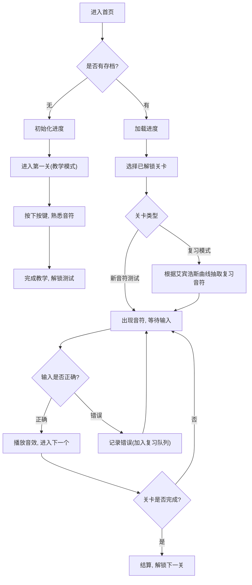

## 1. 产品概述
键盘钢琴家（Keyboard Pianist）是一款专为PC端设计的网页版音乐学习应用。
- 旨在通过游戏化的闯关模式，帮助用户从零基础学习电脑键盘与钢琴音符的对应关系，并逐步掌握弹奏整首歌曲的能力。
- 结合艾宾浩斯遗忘曲线，科学高效地帮助用户巩固易错音符，提升学习效果。

## 2. 核心功能

### 2.1 用户角色
| 角色 | 注册方式 | 核心权限 |
|------|---------------------|------------------|
| 普通用户 | 本地存储（无需注册） | 体验完整的学习与闯关流程，保存学习进度 |

### 2.2 功能模块
1. **首页（关卡地图）**：展示用户的学习进度，以卡片形式呈现不同阶段的关卡，未解锁关卡置灰。
2. **教学模块（认识键盘）**：在屏幕上展示按键与音符对应关系。按下键盘按键，播放对应音效并高亮显示。
3. **测试模块（单音/多音/曲目挑战）**：屏幕出现音符，用户需按下对应按键，正确则通过，错误则记录失败次数。
4. **复习模块（遗忘曲线）**：根据用户的错误记录和时间间隔，智能推送需要复习的音符（如：错误后的 5分钟、30分钟、12小时、1天等进行重复）。

### 2.3 页面详情
| 页面名称 | 模块名称 | 功能描述 |
|-----------|-------------|---------------------|
| 首页 | 关卡地图 | 展示所有关卡（教学、单音测试、多音测试、简单曲目、复杂曲目），点击已解锁关卡进入。 |
| 学习页面 | 提示区 | 屏幕中央上方大号字体显示当前目标音符或即将弹奏的曲目片段。 |
| 学习页面 | 虚拟键盘区 | 屏幕下方，模拟PC键盘的按键布局，按下时有下陷动画和按键发光视觉反馈，并播放音效。 |
| 学习页面 | 结算弹窗 | 关卡完成后的成绩展示，包含错误次数、解锁新关卡提示等。 |

## 3. 核心流程
用户核心学习与闯关流程

## 4. UI设计
### 4.1 设计风格
- 主色调：深色模式（Dark Mode），背景使用深邃的星空蓝或黑灰色（#121212），让音符和按键的高亮更加醒目。
- 强调色：霓虹蓝（#00f0ff）、柔和的绿色（#00ff66，用于正确提示），红色（#ff3333，用于错误提示）。
- 按钮风格：带有轻微发光效果（Glow）的圆角矩形卡片或按钮，带有明显的交互反馈（按下、悬停）。
- 字体：使用具有未来感或现代感的无衬线字体（如 Inter, Roboto Mono），音符显示使用优雅的衬线体或标准音符符号。
- 布局风格：居中卡片式布局，突出当前的测试音符和下方的虚拟键盘。

### 4.2 页面设计总览
| 页面名称 | 模块名称 | UI 元素 |
|-----------|-------------|-------------|
| 首页 | 关卡地图 | 路径式或网格式的关卡卡片，已解锁带霓虹发光，未解锁暗化并带锁图标。 |
| 学习页面 | 提示区 | 屏幕中央上方，超大号字体显示当前目标音符，附带进度条。 |
| 学习页面 | 键盘区 | 屏幕下方，模拟PC键盘的按键布局，按下时有下陷动画和按键发光。 |

### 4.3 响应式
- 考虑到依赖实体键盘输入，该应用主要针对桌面宽屏优化（Desktop-first），移动端可提示“请在PC端使用键盘体验”。